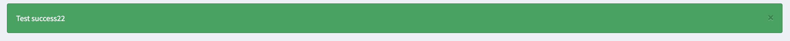
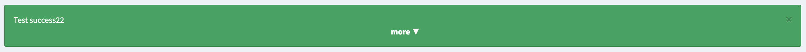
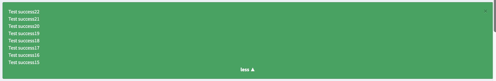

.. index::
    double: Flash Message; Definition

Flash Messages
==============

The bundle comes with a ``FlashManager`` to handle some *session flash messages types* that you can specify in the configuration
to be returned as a ``success``, ``warning`` or ``error`` type (or even all your custom types you want to add).

Additionally, you can also add a ``css_class`` section for each flash messages that will be displayed on rendering.

An Example of type ``success``

When there are more than one flasmessage of a type (``success``, ``warning`` or ``error``),
the flashmessages automatically group.

Grouped flashmessage (collapsed)

Grouped flashmessage (expanded)

Configuration
-------------

.. configuration-block::

    .. code-block:: yaml

        # config/packages/sonata_twig.yaml

        sonata_twig:
            flashmessage:
                success:
                    types:
                        - { type: my_custom_bundle_success }
                        - { type: my_other_bundle_success }

                warning:
                    types:
                        - { type: my_custom_bundle_warning }

                error:
                    css_class: danger # optionally, a CSS class can be defined
                    types:
                        - { type: my_custom_bundle }

                custom_type: # You can add custom types too
                    types:
                        - { type: custom_bundle_type }

You can specify multiple *flash messages types* you want to manage here.

Usage
-----

To use this feature in your PHP classes/controllers::

    $flashManager = $this->get('sonata.twig.flashmessage.manager');

    $messages = $flashManager->get('success');

To use this feature in your templates, include the following template:

.. code-block:: jinja

    

You can also use your own template. Below, you can see an example:

.. code-block:: jinja

    {# check each types #}
    

        {# get messages from current type #}
        

        {# display flash message, sonata_flashmessages_class will return define CSS class #}
        
            

                <button
                        type="button"
                        class="close"
                        data-dismiss="alert"
                        aria-hidden="true"
                        aria-label="{{ 'message_close'|trans({}, 'SonataTwigBundle') }}">
                    &times;
                </button>
                {{ message|raw }}
            

        

    
